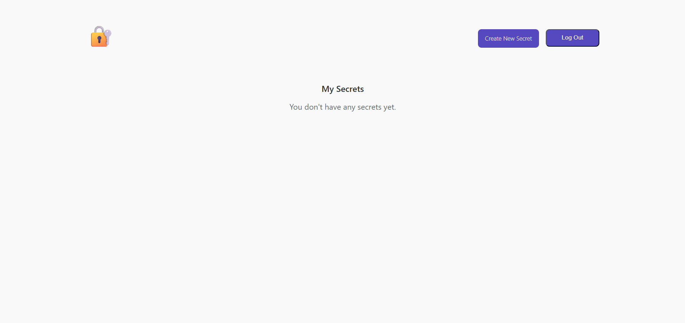
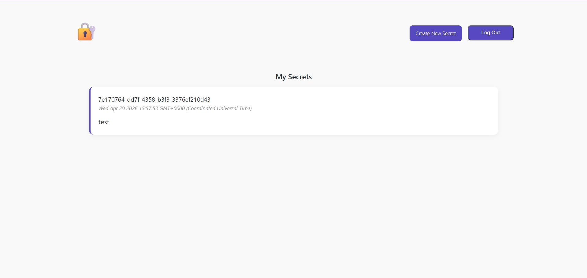
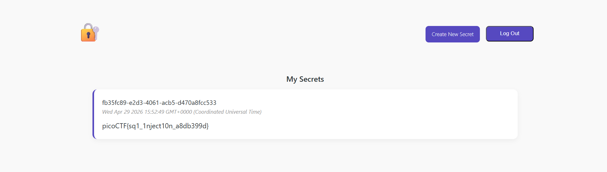

# PicoCTF - Secret Box (Medium, Web Exploitation, picoCTF 2026)
> This secret box is designed to conceal your secrets.
It's perfectly secure—only you can see what's inside.
Or can you? Try uncovering the admin's secret.

## Overview
โจทย์นี้เป็น Web Application ที่มีระบบ Authentication และการจัดการข้อมูลลับ (secrets) โดยใช้ฐานข้อมูลที่ประกอบด้วย 3 ตารางหลัก ได้แก่ `users`, `tokens` และ `secrets` ซึ่งมีการกำหนดให้มีผู้ใช้ `admin` ถูกสร้างขึ้นตั้งแต่เริ่มต้นระบบ พร้อมทั้งเก็บ flag ไว้ในตาราง `secrets` และผูกกับ `admin` ผ่าน `owner_id`

ผู้เล่นสามารถโต้ตอบกับระบบผ่าน API หลัก เช่น การสมัครสมาชิก (`/signup`), เข้าสู่ระบบ (`/login`), ออกจากระบบ (`/logout`) และสร้างข้อมูลลับ (`/secrets/create`) โดยเมื่อเข้าสู่ระบบแล้ว ระบบจะใช้ token ใน cookie เพื่อตรวจสอบสิทธิ์ และแสดง secrets ของผู้ใช้งานผ่านหน้า `/`

จากการวิเคราะห์พบว่าระบบมีช่องโหว่ด้านความปลอดภัยที่สำคัญ 2 จุด ได้แก่:

- การเก็บรหัสผ่านเป็น plaintext ในขั้นตอนสมัครสมาชิก ทำให้หากสามารถเข้าถึงฐานข้อมูลได้ จะสามารถนำ credentials ไปใช้ได้ทันที
- ช่องโหว่ SQL Injection ใน API `/secrets/create` เนื่องจากมีการนำ input ของผู้ใช้ไปประกอบเป็นคำสั่ง SQL โดยตรงโดยไม่มีการ sanitize หรือใช้ parameterized query

ช่องโหว่เหล่านี้สามารถถูกนำมาใช้ร่วมกันเพื่อเข้าถึงข้อมูลของผู้ใช้อื่น (โดยเฉพาะ admin) และดึง flag จากระบบได้

## Vulnerability Analysis
โจทย์ให้ไฟล์ code ขอเว็บและ database มาให้โดยที่ database มีตาราง
- users
- tokens
- secrets
และเมื่อเริ่มต้นเว็บเขาจะสร้าง user admin มาเลยแต่ทีแรกและ insert flag ไว้ที่ตาราง secrets และทำ references ไปที่ id ของ admin

เว็บไซต์มี api มาให้ 5 ตัวคือ
- /
- /login
- /signup
- /logout
- /secrets/create


api `/` ทำหน้าที่ดึงเอาข้อมูลในตาราง secret ของ user ที่เรา login มาแสดง

api `/login` ทำหน้าที่ login ตามปกติรับ username และ password มาแล้วทำการเช็คและสร้าง token สำหรับเป็น cookie ในการเข้าใช้งานระบบ

api `/signup` ทำการลงทะเบียนเข้าใช้งานตามปกติโดยรับ username และ password ไปบันทึกลง database และจุดที่มีช่องโหว่คือตรงนี้ด้วยคับการ register มีช่องโหว่คือ password เก็บเป็น plaintext ไม่ได้ทำการเข้ารหัสไว้
``` javascript
app.post('/signup', async (req, res) => {
	const { username, password} = req.body;


	const userResult = await db.raw(
		`SELECT * FROM users WHERE username = ? LIMIT 1`, 
		[username]
	);

	if (userResult.rows.length >= 1){
		// user exist
		return res.render('signup', {message: null, error: 'Username already exists'});
	}

	const createUserQuery = await db.raw(
		`INSERT INTO users(username, password) VALUES (?, ?)`, 
		[username, password]
	);

	// render to login page: create user only, not logging in automatically
	return res.render('login', {message: 'Create User Successful', error: null});
});
```
ทำให้ถ้าทำการเข้าถึง database ได้จะสามารถเข้าสู่ระบบด้วย username admin ได้เลย

api `/logout` ทำการ logout แบบปกติคือ clean cookie แล้ว redirect ไปที่หน้า / ซึ่ง middleware จะเป็นตัวเช็คว่ามี cookie มั้ยถ้าไม่จะ redirect ไปที่หน้า login โดยอัตโนมัติ

api `/secrets/create` คือ api สำหรับสร้าง secret โดยใช้ userId ที่ได้มาจากการนำ token ไป select เอาค่า id ของ username นั้นๆมาและรับค่า content จากผู้ใช้งานมาด้วยซึ่งผมได้สังเกตว่าโค้ด INSERT ของระบบมีช่องโหว่ที่อาจเกิด sql injection ได้เพราะว่าระบบทำการนำเอา string ที่รับค่าจากผู้ใช้งานมาแปะใส่คำสั่ง sql เลย
``` javascript
`INSERT INTO secrets(owner_id, content) VALUES ('${userId}', '${content}')`
```

## Exploitation Steps

### Step 1 Account Registration & Initial Access
ผมทำการสร้าง account เพื่อที่จะทำให้ผมเพิ่ม secret ได้


### Step 2 Exploiting SQL Injection to Overwrite Admin Password
ผมทำการเพิ่ม secret โดยใช้ payload ตามนี้คือ
``` sql
test'); UPDATE users SET password='test' WHERE username='admin' -- 
```
เพื่อทำการ update ค่า password ของ admin ให้เราสามารถเข้าใช้งาน account ของ admin ได้ (db เก็บ password เป็น plaintext เลยทำให้เราสามารถแก้ไขค่า password ได้โดยตรงโดยไม่ต้องเข้ารหัสใดๆเลย)


### Step 3 Admin Account Takeover & Flag Retrieval
ทำการ login เข้า account ของ admin เพื่อที่จะเอาค่า flag ออกมา

และค่า flag ที่ได้คือ `picoCTF{sq1_1nject10n_a8db399d}`