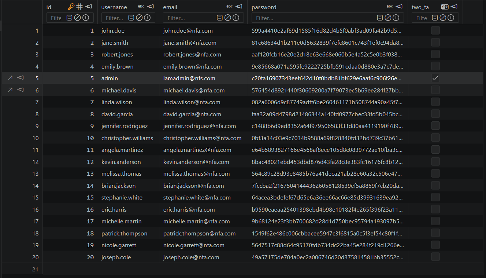
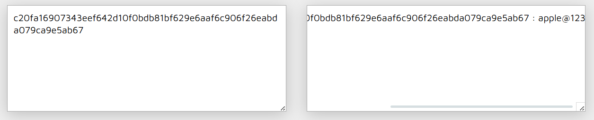
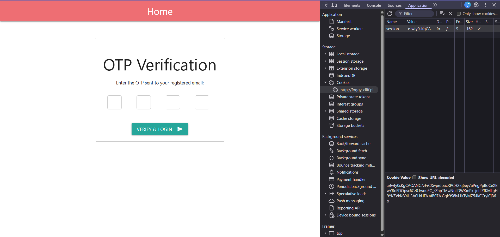
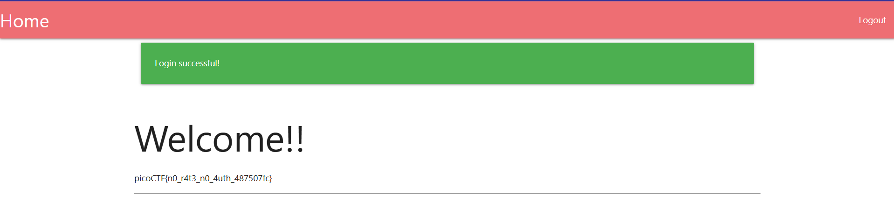

# PicoCTF - NO FA (Medium, Web Exploitation)
> Seems like some data has been leaked! Can you get the flag?

## Overview
โจทย์ข้อนี้เป็น Web Application ที่พัฒนาด้วย Flask โดยมีกลไกการยืนยันตัวตนแบบ Two-Factor Authentication (2FA) ช่องโหว่หลักเกิดจากการหลุดลอยของข้อมูลสำคัญ (Credential Leakage) ในไฟล์ฐานข้อมูล และการจัดการ Session ของ Flask ที่ไม่ปลอดภัย ทำให้สามารถเข้าถึงสิทธิ์ Admin ได้โดยไม่ต้องผ่านกระบวนการยืนยันตัวตนที่แท้จริง

## Vulnerability Analysis

โค๊ดที่โจทย์ให้มี API อยู่ 4 path คือ 
- /
- /login
- /two_fa
- /logout

หน้า / จะทำหน้าที่ print flag ออกมาถ้า username เป็น admin
``` python
if session.get('username') == 'admin':
    flag = os.getenv('FLAG')
```
แต่ถ้า username เป็น username อื่นระบบจะแสดงแค่ `No flag for you!!` ออกมาและถ้า user ไม่ได้ทำการ login ระบบจะ redirect ไปหน้า login โดยอันโนมัติ
``` python
if 'username' not in session or session['logged'] == 'false':
    flash('Please login to access this page', 'red')
    return redirect(url_for('login'))
```

หน้าที่ 2 คือ /login ระบบจะทำการรับ username และ password เข้ามาและทำการเช็คใน database ว่ามี username นี้ไหมถ้ามีจะดึงข้อมูลมาเก็บไว้ในตัวแปร user และนำไปเช็ค password ด้วยการนำ password ที่ user กรอกเข้ามาไป compare กันว่าตรงกันมั้ยถ้าตรงระบบจะไปเช็คต่อว่า user นั้นต้องการ two fa ในการเข้าใช้งานไหมถ้าใช่ระบบจะ random เลข OTP ขึ้นมาและเก็บไว้ที่ session ของเว็ปและนี่คือจุดตายที่เราจะสามารถเข้าใช้งานโดยที่เราไม่ต้องมี gmail ให้ระบบส่ง OTP ไปให้ก็ได้คับ
``` python
if user['two_fa']:
    # Generate OTP
    otp = str(random.randint(1000, 9999))
    session['otp_secret'] = otp
    session['otp_timestamp'] = time.time()
    session['username'] = username
    session['logged'] = 'false'
    # send OTP to mail ---
    return redirect(url_for('two_fa'))
```
ส่วน api ของ /two_fa กับ /logout ก็ทำหน้าที่ตามปกติของมันคือรับ OTP แล้วเช็คค่ากับ OTP ใน session ว่าตรงกันมั้ยหรือหมดเวลามั้ยถ้าผ่านแล้วก็จะสามารถ login ได้ส่วนของ logout ก็ออกจากระบบตามปกติเลยคับ ล้าง session username กับตั้งค่า session logged เป็น false

## Exploitation Steps
### Step 1 Extract Credentials from Database
ผมทำการเข้าไปอ่านโค๊ดและอ่านไฟล์ db ที่ โจทย์ให้แล้วไปเจอ username และ password ของ admin (password ทำการเข้ารหัสด้วย sha256 อยู่)


### step 2 Crack Admin Password
ผททำการนำ password ของ admin ที่ hash ไว้ไปถอดรหัสด้วยเว็ป [md5decrypt](https://md5decrypt.net/en/Sha256/) และได้ออกมาคือ `apple@123`


### step 3 Authenticate as Admin
ผมนำเอา username และ password ที่ได้ไปทำการ login ผลสรุปคือ username และ password ถูกต้องและเราสามารถเข้าหน้ากรอก OTP ได้และเราก็เห็น session ที่ระบบ generate มาให้ด้วย


### step 4 Decode Flask Session
ผมทำการนำเอา session ที่ได้ไป decrypt ด้วย flask-unsign เพราะว่าตัวเว็ปใช้ flask ในการสร้างเว็ปและจัดการ session และผมก็ได้ข้อมูลของ OTP และอื่นๆออกมา
``` bash
┌──(venv)─(kali㉿kali)-[~]
└─$ flask-unsign --decode --cookie '.eJwty0sKgCAQANC7zFrCXwpeJoacRPCH2iq6ey7aPngPpBoCeXBwYRoEDOpsx6Cz01wouFC_zZhpTMwNnLDWKmPkLjetLZfKMLgH9YKZVkKfY4H3A0LkHFA.afB07A.Gqk9S8k41KTyMZ54KCCrylCjB6o'
{'logged': 'false', 'otp_secret': '1013', 'otp_timestamp': 1777366252.4470236, 'username': 'admin'}
```

### step 5 Bypass 2FA
ผมทำการนำเอา OTP ที่ได้ไปกรอกและเราก็เจอ flag เลย flag คือ `picoCTF{n0_r4t3_n0_4uth_487507fc}`
